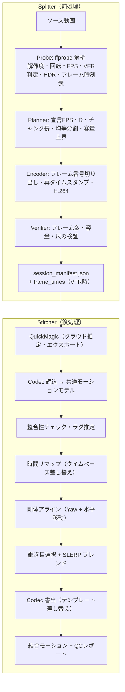
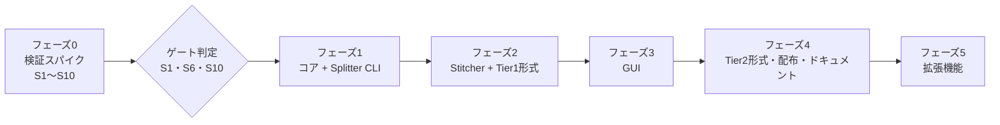

# Split & Stitch for QuickMagicMotion — 開発設計計画書

| 項目 | 内容 |
| --- | --- |
| 正式名称 | Split & Stitch for QuickMagicMotion |
| 開発コードネーム | QuickPipeline |
| 文書版数 | v1.0（ドラフト） |
| 作成日 | 2026-10-07 |
| 位置づけ | 原設計書「システム詳細設計書: QuickPipeline」のレビュー結果を反映した、実装着手用の設計計画書 |

> **用語ルール（製品ドキュメント共通）**
> 製品 UI・README・ヘルプ・リリースノートでは「プロフェッショナル」「プロユース」等の語を使用しない。品質は具体的な数値・機能で表現する（例:「全フレーム保持」「フレーム単位で正確な分割」）。なお QuickMagic のプラン名 “Pro” は固有名詞としてそのまま表記する。

---

## 0. エグゼクティブサマリ

原設計の骨格（分割 → クラウド推定 → 結合、および全フレーム保持のための時間軸拡張）は妥当。ただし実装すると**確実に破綻する箇所**と、**未検証の前提に依存している箇所**がある。本計画書では以下を行う。

1. **計算誤り・仕様欠陥の修正**（VMD のフレーム換算式、ルート補正の基準点、縦長動画のスケール式、59.94fps / 可変フレームレートの扱い など）
2. **設計原則の再定義**: 「秒」ではなく「ソースフレーム番号」を唯一の真実（Single Source of Truth）とし、全工程を有理数タイムベースで扱う
3. **“11形式” を “コンテナ × リグプロファイル” に再編**し、実装可能な範囲を明確化
4. **フェーズ0（検証スパイク）を必須工程として新設**: QuickMagic 側の挙動・規約に依存する前提を、実装前に実測で確定させる
5. 品質保証（境界品質の定量レポート、フレーム正確性の自動テスト）と配布（ライセンス、パッケージング）を設計に組み込む

---

## 1. 原設計レビュー結果（差分サマリ）

### 1.1 重大（修正必須）

| # | 対象 | 問題 | 修正方針 |
| --- | --- | --- | --- |
| C1 | §5.2-1 VMD 換算式 `Real = Stretched × R` | **誤り**。時間軸拡張では「ソース1フレーム = アップロード動画1フレーム」なので、フレーム番号は**恒等写像**（変化しない）。変わるのはタイムベースのみ。さらに VMD は **30fps 固定タイムベース**のため、×R すると再生速度が 1/4 になる。60/120fps を VMD に無損失格納することは原理的に不可能 | フレーム番号は不変、タイムベースのみ差し替える方式に統一（§6.2）。VMD は 30fps へのリサンプル出力のみ（警告表示） |
| C2 | §5.2-2 ルート補正「前クリップ終端 vs 次クリップ開始」 | オーバーラップがあるため、両者は**別時刻の姿勢**。差分を取るとオーバーラップ分の移動量だけ誤ってオフセットされる | オーバーラップ区間の**同一時刻**同士で比較し、Yaw回転 + 水平移動の剛体変換を推定（§6.4） |
| C3 | §5.1-1 `scale='max(1920,iw)':-2` | **縦長動画（1080×1920）を 1920×3413 に拡大**してしまう。スマートフォン撮影の縦長ダンス動画は主要ユースケース | 短辺基準のスケール式に変更（§5.5） |
| C4 | `setpts=2.0*PTS,fps=30` | 59.94fps（R=1.998）や可変フレームレート（iPhone 等）で `fps` フィルタがフレームの複製/間引きを起こし、「全フレーム保持」が保証されない | フレーム番号ベースの再タイムスタンプ `setpts=N/(FD*TB)` + `-fps_mode passthrough`（§5.4） |
| C5 | `-ss {秒} -t {秒}` による切り出し | 秒指定はフレーム境界の丸め誤差で ±1 フレームずれる。VFR では更に不定 | 事前にフレーム時刻表を作成し、**フレーム番号で切り出し**、出力フレーム数を検証（§5.4） |
| C6 | 11形式すべてを結合対応 | BIP / C4D / iClone 独自形式は仕様非公開で、読み書き実装は現実的でない。一方、Unreal / Mixamo / Unity / CC 等の多くは実体が FBX である可能性が高い | 「コンテナ（実ファイル形式）× リグプロファイル（ボーン命名・軸・単位）」に再編し、Tier 分け（§7） |
| C7 | 時間軸拡張の有効性 | 「スロー化しても推定精度が落ちない」は**未検証の仮説**。物理ベース補正（接地・重力）や時間方向フィルタを持つ推定器では、スロー映像が「低重力・低速運動」と解釈され劣化する可能性がある | フェーズ0で定量比較（ネイティブ60fps vs 拡張30fps vs 間引き30fps）を必須化（§3） |
| C8 | 利用規約 | Free プランで高FPSを得る用途は、QuickMagic の利用規約上「プラン制限の回避」と解釈されるリスクがある | 規約確認をフェーズ0のゲートに設定。確認完了まで機能はデフォルト無効 + 注意表示（§12） |

### 1.2 中（品質・堅牢性に影響）

| # | 対象 | 問題 | 修正方針 |
| --- | --- | --- | --- |
| M1 | 容量制御 | CRF 指定ではファイルサイズが保証されない。超過時に「該当チャンクのみ尺短縮」すると後続の分割計画が全て崩れる | **VBV 上限による容量の数学的上界**を用いて事前に保証（§5.3）。超過時は画質側（CRF/maxrate）で再調整し、分割計画は不変に保つ |
| M2 | 最終チャンク | 均等割りでないため、末尾に数秒だけの短チャンクが生じ、推定品質が落ちる | 全チャンク長の**均等化**（§5.2） |
| M3 | 1080p 判定 | 「短辺<1080 または 長辺<1920」だと 1440×1080（4:3）を誤判定 | 短辺基準 + 閾値は設定値（フェーズ0で実測確認） |
| M4 | 4K 維持のデフォルト | 推定器は内部で縮小処理している可能性が高く、4K 維持はチャンク数（=継ぎ目）を増やすだけになりうる | 解像度ポリシー `auto` を既定とし、必要時のみ `keep`（§5.5）。被写体が小さい場合の固定 ROI クロップを将来機能として追加 |
| M5 | オーバーラップ全体でのブレンド | 各チャンクの先頭・末尾は推定器の時間的文脈が不足し精度が低い（エッジ効果） | オーバーラップ = ガード + ブレンド窓 + ガード の構造化。継ぎ目位置を姿勢誤差最小点に自動選択（§6.5） |
| M6 | フレーム欠損補間 | 総数不一致時に「どこが欠損したか」は特定できない | 不一致の大きさで方針を分岐 + 隣接チャンク間の**時間ずれ（ラグ）推定**で自己診断（§6.3） |
| M7 | GUI のブレンド設定 `Linear / SmoothStep / Slerp` | SLERP は補間方式であってイージング曲線ではない（カテゴリ混在） | 回転補間は常に SLERP。イージングは Linear / SmoothStep / Cosine から選択 |
| M8 | HDR / 10bit / 回転メタデータ / インターレース | iPhone の HLG/Dolby Vision 動画を単純に yuv420p 化すると色が破綻。回転メタデータ無視で幅高さを誤認 | プローブ段階で検出し、トーンマップ・自動回転・デインターレースを適用（§5.5） |
| M9 | クォータ消費 | 時間軸拡張はアップロード秒数を R 倍消費する | シミュレータで「消費秒数」を明示 |
| M10 | ダウンロードファイルの対応付け | QuickMagic 側のファイル名が予測不能だと結合順を誤る | チャンク名にセッションID・番号・総数を埋め込み、照合 + フレーム数で二重検証（§8.3） |

### 1.3 新規追加

- 有理数タイムベース（`60000/1001` 等）と VFR 対応（フレーム時刻表の保存）
- `probe` / `plan`（ドライラン）/ `verify` / `qc` コマンド、`--json` 出力、終了コード体系
- 境界品質レポート（継ぎ目ごとの姿勢不一致・ルート補正量・ラグ・加速度スパイク）
- 中断再開（`--resume`）、再現性のためのエンコードコマンド記録
- プラン仕様の外部データ化（`plans.yaml`）— プラン改定時にコード変更不要
- フレーム番号を埋め込んだ合成動画・解析的モーションによる自動テスト基盤
- 配布ライセンス（FFmpeg/x264 の GPL、FBX SDK、Blender）の整理

---

## 2. 設計原則

1. **フレーム番号が唯一の真実**: 全工程の基準は「ソース動画の 0 始まりフレーム番号」。秒はフレーム時刻表から導出する派生値として扱う。
2. **有理数タイムベース**: FPS・比率は `fractions.Fraction` で保持し、浮動小数点の累積誤差を排除する。マニフェストでは `"60000/1001"` 形式の文字列で記録する。
3. **区間は半開区間 `[start, end)`**: 長さ = `end - start`。オフバイワンを仕様レベルで排除する。
4. **非破壊**: 結合は QuickMagic の推定結果を改変しない。手を加えるのは「時間軸の付け替え」「剛体アライン」「ブレンド窓内の補間」のみ。平滑化などの追加加工はオプション扱い。
5. **同一形式入出力**: 結合出力は入力と同じコンテナ・同じリグ。形式変換・リターゲットはスコープ外（将来拡張）。
6. **外部依存の仮定はデータで持つ**: プラン上限・受理解像度・容量単位など QuickMagic 依存の値はすべて設定ファイルに置き、検証結果で更新する。
7. **コアと UI の分離**: 全ロジックは UI 非依存のコアライブラリに実装し、CLI と GUI は薄いアダプタとする（CLI と GUI の機能完全同等を構造的に保証）。

---

## 3. フェーズ0: 検証スパイク（実装前に必須）

原設計の前提の多くは QuickMagic 側の挙動に依存する。以下を実測で確定させてから本実装に入る。各項目の結果は `docs/spike_results.md` と `plans.yaml` に反映する。

| ID | 検証項目 | 方法 | 結果が影響する設計 |
| --- | --- | --- | --- |
| S1 | **時間軸拡張の精度** | 同一の 60fps 素材を (a) Basic で 60fps ネイティブ (b) 30fps 宣言の拡張版 (c) 30fps 間引き版 でアップロードし、関節角度の差（平均・95%点）、足接地、ジャンプ時の滞空軌道を比較 | 拡張モードの可否・推奨 R の上限（例: R≤2 のみ推奨） |
| S2 | 受理条件 | 解像度（720p/1080p/1440p/4K、縦長）、コーデック（H.264/HEVC）、プロファイル/レベル、30.000 秒ちょうど・900 フレームちょうどの境界値 | `plans.yaml` の閾値、`duration_margin` |
| S3 | 容量の単位 | 50,000,000 B と 52,428,800 B（50 MiB）付近のファイルで受理境界を確認 | 容量計算の単位と安全係数 |
| S4 | Free プランへの高FPS入力 | 60fps 動画を Free でアップロードした時の挙動（拒否 / 内部間引き） | 通常モードで事前間引きが必要か |
| S5 | 出力フレーム数と時刻 | 入力 N フレームに対する出力サンプル数、先頭時刻、エクスポート FPS 選択肢の有無（内部補間の有無） | 時間リマップ式・整合性チェックの許容値 |
| S6 | **エクスポート形式の実体** | 11 プリセットすべてをダウンロードし、拡張子・バイナリ/ASCII・ボーン名・軸・単位・キー密度を調査 | §7 のコンテナ分類と Tier |
| S7 | チャンク間の座標系 | 各チャンクの初期ルート位置・向き・床高さが毎回正規化されるか | アライン方式の既定値 |
| S8 | エッジ効果の幅 | 長尺推定とチャンク推定を比較し、チャンク端で誤差が増える範囲（フレーム数） | ガード幅・オーバーラップ既定値 |
| S9 | ダウンロードファイル名規則 | アップロード名とエクスポート名の対応 | チャンク命名・照合ロジック |
| S10 | 利用規約・商標 | QuickMagic 利用規約、API 規約、商標表示の可否を確認 | 拡張モードの提供可否、名称・免責表示 |

**ゲート判定**: S1・S6・S10 の結果で開発スコープを確定する。S1 で劣化が有意な場合、拡張モードは「プランが受理しない FPS（240fps、50fps、25fps 等）を最も近い受理 FPS に載せる用途」に限定する。

---

## 4. システム構成

### 4.1 全体アーキテクチャ



### 4.2 技術スタック（決定事項）

| 領域 | 採用 | 理由 / 不採用案 |
| --- | --- | --- |
| 言語 | Python 3.12 | 数値計算・FFmpeg 制御・GUI を単一言語で統一 |
| パッケージ管理 | uv + `pyproject.toml` | 再現可能なロックファイル |
| CLI | Typer | 型ヒントからヘルプ生成 |
| データモデル | Pydantic v2 | マニフェストのスキーマ検証・JSON Schema 自動生成 |
| 数値 | NumPy, SciPy（`Rotation`, `Slerp`） | クォータニオン演算の実績 |
| 動画 | FFmpeg / ffprobe（外部プロセス） | PyAV は配布サイズとビルド互換性の面で不採用。`-progress pipe:1` で進捗取得 |
| GUI | **PySide6** | Tauri はコアが Python のため Python サイドカー + IPC の二重スタックになり、保守コストが高い |
| FBX | 自前のバイナリ FBX ノード入出力 + テンプレート差し替え（第一案）／Autodesk FBX SDK（代替） | §7.3 参照。フェーズ0で確定 |
| テスト | pytest, Hypothesis（性質ベーステスト） | 分割計画の不変条件を網羅的に検証 |
| 配布 | PyInstaller（第一案）／Nuitka | §11 参照 |

### 4.3 リポジトリ構成

```text
QuickMagic_Split&Stitch/
├── pyproject.toml
├── docs/
│   ├── design_plan.md          # 本書
│   ├── spike_results.md        # フェーズ0結果
│   └── adr/                    # 設計判断記録（ADR）
├── src/splitstitch/
│   ├── config/plans.yaml       # プラン仕様（データ）
│   ├── core/
│   │   ├── timebase.py         # 有理数FPS・フレーム時刻表
│   │   ├── probe.py            # ffprobe 解析
│   │   ├── planner.py          # 分割計画（純粋関数）
│   │   ├── ffmpeg_cmd.py       # コマンド構築（純粋関数）
│   │   ├── encoder.py          # 実行・進捗・キャンセル
│   │   ├── verifier.py
│   │   ├── manifest.py         # Pydantic スキーマ
│   │   └── session.py          # セッションディレクトリ管理・再開
│   ├── motion/
│   │   ├── model.py            # 共通モーションモデル
│   │   ├── quat.py             # 半球合わせ・SLERP・Euler展開
│   │   ├── remap.py            # 時間リマップ・リサンプル
│   │   ├── align.py            # 剛体アライン
│   │   ├── seam.py             # 継ぎ目選択・ラグ推定
│   │   ├── blend.py
│   │   ├── stitch.py           # 結合オーケストレーション
│   │   └── qc.py               # 品質指標・レポート
│   ├── codecs/
│   │   ├── base.py             # Codec インタフェース・能力宣言
│   │   ├── bvh.py
│   │   ├── fbx/                # binary_io.py, template.py, curves.py
│   │   ├── vmd.py
│   │   ├── unity_anim.py
│   │   └── facial.py           # Onlyface（形式はS6で確定）
│   ├── rigs/                   # リグプロファイル（YAML）
│   ├── cli/main.py
│   └── gui/
└── tests/
    ├── unit/ property/ integration/ golden/
    └── generators/             # 合成動画・合成モーション生成
```

---

## 5. Splitter（動画分割）詳細設計

### 5.1 記号定義

| 記号 | 意味 |
| --- | --- |
| $N$ | ソース総フレーム数 |
| $f_s$ | ソース FPS（有理数。VFR の場合は公称値） |
| $f_d$ | 宣言 FPS（アップロード動画のフレームレート） |
| $R = f_s / f_d$ | 拡張比率（有理数。59.94→30 なら 2000/1001） |
| $L$ | 1チャンクのフレーム数（ソースフレーム数 = アップロードフレーム数、1:1） |
| $O$ | オーバーラップのフレーム数（ソースフレーム基準） |
| $T_{lim}(f_d)$ | プランの宣言FPSごとの最大尺 |
| $S$ | プラン容量上限（バイト）、$\eta$: 安全係数（既定 0.95） |
| $b_f$ | 1フレームあたり最大ビット数（$= \text{maxrate}/f_d$） |
| $B$ | VBV バッファサイズ（ビット） |
| $H$ | コンテナオーバーヘッド見積り（バイト） |

> **原設計からの変更点**: 原設計は「秒」と「目標ビットレート」で上限を計算していたが、時間軸拡張では同一画質に必要なのは**1フレームあたりのビット数**であり、秒あたりのビットレートは $f_d$ に依存する。フレーム単位で計算すると FPS に依らない統一式になる。

### 5.2 分割計画アルゴリズム

**(1) 宣言 FPS の決定**

| モード | 規則 |
| --- | --- |
| 通常（`native`） | $f_s$ がプランの受理FPS集合に含まれれば $f_d=f_s$。含まれなければ受理FPS以下で最大の値へ間引き（`fps` フィルタ） |
| 拡張（`stretch`） | 受理FPS集合から $\lvert\log R\rvert$ が最小となる $f_d$ を選択（同値なら低い方）。Free は常に $f_d=30$。59.94fps 素材を Basic 以上で扱う場合は $f_d=60$（$R≈1.001$、実質ネイティブ）となる |

**(2) チャンク長の上限**

$$L_{dur} = \left\lfloor \left(T_{lim}(f_d) - m\right) \cdot f_d \right\rfloor \qquad (m: \text{尺マージン、既定 } 0.1\text{ s、S2 で確定})$$

$$L_{size} = \left\lfloor \frac{8\eta S - B - 8H}{b_f} \right\rfloor$$

$$L = \min(L_{dur},\ L_{size})$$

**(3) 実行可能性判定**: $L - O \ge U_{min}$（既定: ユニーク区間がソース実時間で 3 秒以上）。満たさない場合、解像度ポリシーが `auto` なら縮小して再計算、`keep` なら終了コード 4 で停止し、必要な縮小率を提示する。

**(4) チャンク数と均等化**

$$n = \max\left(1, \left\lceil \frac{N - O}{L - O} \right\rceil\right), \qquad L^* = \left\lceil \frac{N + (n-1)O}{n} \right\rceil, \qquad P = L^* - O$$

$$\text{chunk}_i = [\,iP,\ \min(iP + L^*, N)\,), \quad i = 0,\dots,n-1$$

**計算例（Free、60fps、1920×1080、60 秒 = 3,600 フレーム、オーバーラップ 1.0 秒）**

- $f_d = 30$、$R = 2$、$L_{dur} = \lfloor (30-0.1)\times 30 \rfloor = 897$
- $b_f = 400$ kbit/frame（30fps 換算 12 Mbps）、$B = 12$ Mbit、$H ≈ 0.1$ MB → $L_{size} = \lfloor (380 - 12 - 0.8)/0.4 \rfloor = 918$
- $L = 897$、$O = 60$、$n = \lceil 3540/837 \rceil = 5$、$L^* = \lceil 3840/5 \rceil = 768$、$P = 708$
- チャンク: `[0,768)`, `[708,1476)`, `[1416,2184)`, `[2124,2892)`, `[2832,3600)` — 全チャンク 768 フレーム（拡張後 25.6 秒）
- 均等化しない場合は 897 フレーム × 4 + 末尾 252 フレーム（拡張後 8.4 秒）となり、末尾の推定品質が落ちる
- クォータ消費: 5 × 25.6 = 128 秒（ソース 60 秒に対し約 2.13 倍）

**不変条件（性質ベーステストで検証）**: 全フレームを被覆／各チャンク長 ≤ $L$／隣接チャンクの重なり ≥ $O$／容量上界 ≤ $\eta S$／$n$ は最小。

### 5.3 容量保証（原設計 §7-2 の置き換え）

capped CRF（`-crf` + `-maxrate` + `-bufsize`）を用いる。VBV 制約により、ファイル全体のビット数は次で上から抑えられる。

$$\text{bits}_{total} \le \text{maxrate} \cdot \frac{L}{f_d} + B$$

これを §5.2 の $L_{size}$ に組み込むため、**エンコード前に容量超過しないことが保証される**。単純な素材では CRF が支配的になり、ファイルはさらに小さくなる。

- エンコード後に `verifier` が実サイズを確認し、万一超過した場合（コンテナオーバーヘッドの見積り誤差など）は、**分割計画を変えずに** maxrate を 5% 下げて当該チャンクのみ再エンコードする（最大 3 回）。
- 原設計の「該当チャンクのみ尺短縮」は後続の全境界がずれるため廃止。ただし `--size-policy replan` 指定時は当該チャンク以降を再計画する。

**品質プリセット**（初期値。S1/S2 の結果で較正）

| プリセット | CRF | 1080p 時 $b_f$ | 用途 |
| --- | --- | --- | --- |
| `high`（既定） | 18 | 400 kbit | 速い動き・細かい手指 |
| `balanced` | 20 | 280 kbit | 一般的な動き。チャンク数削減 |
| `compact` | 22 | 200 kbit | クォータ節約 |

解像度が異なる場合、$b_f$ は画素数比の 0.75 乗でスケールする（$b_f \propto (W H)^{0.75}$）。

### 5.4 エンコード仕様（フレーム正確な切り出し）

**手順**

1. `probe` で全フレームの PTS を取得し、フレーム時刻表 `frame_times` を作成（`ffprobe -select_streams v:0 -show_entries frame=pts,duration`、大容量時はパケット単位で高速化）。
2. チャンク `[a, b)` について、入力シークは `pts(a)` より少し手前（キーフレーム到達用、既定 2 秒手前）に置き、`trim` で正確なフレームから開始する。
3. フレーム番号で再タイムスタンプし、FPS 変換フィルタは使わない。

```bash
ffmpeg -hide_banner -y -progress pipe:1 \
  -ss {SEEK_SEC} -i "{INPUT}" \
  -map 0:v:0 -an -sn -dn \
  -vf "trim=start_pts={PTS_A}:end_pts={PTS_B},setpts=N/({FD}*TB),{COLOR_CHAIN}{SCALE_CHAIN}format=yuv420p" \
  -fps_mode passthrough -r {FD} \
  -c:v libx264 -preset slow -crf {CRF} -maxrate {MAXRATE}k -bufsize {BUFSIZE}k \
  -profile:v high -level:v {LEVEL} -g {GOP} \
  -color_primaries bt709 -color_trc bt709 -colorspace bt709 \
  -movflags +faststart -metadata comment="splitstitch:{SESSION_ID}:{INDEX}" \
  "{OUTDIR}/{CHUNK_NAME}.mp4"
```

- `setpts=N/(FD*TB)`: 出力 N 番目のフレームに時刻 `N/FD` を割り当てる。R が整数でも非整数でも、VFR でも、**入力フレームと出力フレームが 1:1** になる。
- `trim` は `-ss` 適用後の時刻で評価されるため、`PTS_A/PTS_B` はシーク位置を差し引いた値で渡す（`ffmpeg_cmd.py` が計算）。
- 出力後、`ffprobe -count_frames` でフレーム数が `b - a` と一致することを必ず検証する（不一致は終了コード 5）。
- 4K を全チャンクで繰り返しデコードする負荷を避けるため、`split` フィルタで 1 回のデコードから複数チャンクを並行出力するモードを実装する（`--single-pass`）。
- コマンドは常に引数リストで実行し、シェルを経由しない（パスに `&` や空白・非 ASCII 文字を含むため。本リポジトリ名自体が `&` を含む）。
- 実行したコマンド全文をマニフェストに記録し、再現性を確保する。

### 5.5 映像正規化

| 項目 | 検出 | 処理 |
| --- | --- | --- |
| 回転メタデータ | `side_data` の displaymatrix | 自動回転を適用し、回転後の幅・高さで計画する |
| 解像度 | 回転後の短辺 $s$ | ポリシーに従う（下表） |
| HDR（PQ / HLG） | `color_transfer` | `zscale` + `tonemap` で SDR BT.709 へ変換（libzimg 非搭載の FFmpeg ではエラーで停止し理由を表示） |
| 10bit | `pix_fmt` | 8bit yuv420p へ変換 |
| インターレース | `field_order` | `bwdif=mode=send_field`（フィールドごとにフレーム化し、50i→50p 等として扱う） |
| シーンカット | `select='gt(scene,0.4)'` による簡易検出 | 警告のみ（単一の連続テイクを前提とするため） |
| 音声 | — | `-an` で除去（原設計どおり） |

**解像度ポリシー**（短辺基準。閾値 1080 は `plans.yaml` の `min_short_side`）

| ポリシー | 動作 |
| --- | --- |
| `auto`（既定） | 短辺 < 1080 は 1080 へ Lanczos 拡大。短辺 > 1080 は、そのままで $L - O \ge U_{min}$ を満たし、かつチャンク数が 1080 化した場合と同じなら維持し、そうでなければ短辺 1080 へ縮小 |
| `keep` | 元解像度を維持（拡大のみ行う）。容量に応じてチャンクが短くなる |
| `1080` / `1440` | 短辺を指定値に固定 |
| `reject-low` | 短辺 < 1080 ならエラー停止 |

スケール式（短辺を `{S}` にする。偶数丸め）:

```text
scale='if(lt(iw,ih),{S},-2)':'if(lt(iw,ih),-2,{S})':flags=lanczos
```

### 5.6 チャンク命名

```text
{stem}_{sid}_c{index:03d}of{total:03d}.mp4      例: Dance_7f3a2c_c002of005.mp4
```

`sid` はセッションIDの短縮形（6桁16進）。QuickMagic のエクスポート名にアップロード名が引き継がれれば、結合時に自動照合できる（S9 で確認）。

---

## 6. Stitcher（モーション結合）詳細設計

### 6.1 共通モーションモデル

```python
@dataclass
class Skeleton:
    names: list[str]
    parents: np.ndarray          # (J,) 親インデックス、ルートは -1
    rest_offsets: np.ndarray     # (J, 3)
    rotation_orders: list[str]   # Euler 系形式の書き戻し用
    root_index: int              # 位置チャンネルを持つ関節（Hips 等）

@dataclass
class MotionClip:
    skeleton: Skeleton
    timebase: TimeBase           # 有理数 FPS または明示タイムスタンプ列
    local_rot: np.ndarray        # (F, J, 4) クォータニオン xyzw
    root_pos: np.ndarray         # (F, 3) 内部座標系: Y-up / メートル / 右手系
    extra_pos: dict[int, np.ndarray]  # 位置チャンネルを持つ他関節（BVH 等）
    curves: dict[str, np.ndarray]     # ブレンドシェイプ等のスカラー曲線
    source: CodecContext         # 書き戻し用テンプレート・軸・単位・プリ回転
```

Codec は `read() -> MotionClip`、`write(clip, template)` と、能力宣言（時間ベース/フレームベース、FPS 制約、小数フレーム可否）を持つ。

### 6.2 時間リマップ（原設計 §5.2-1 の置き換え）

**基本式（全形式共通）**: チャンク $i$（開始ソースフレーム $s_i$）の QuickMagic 出力の $k$ 番目のサンプル（出力 FPS $f_q$）について、

$$\phi = s_i + k \cdot \frac{f_d}{f_q} \qquad (\text{ソースフレーム位置、一般に小数})$$

$$t_{real} = \begin{cases} \phi / f_s & (\text{CFR}) \\ \mathrm{interp}(\texttt{frame\_times}, \phi) & (\text{VFR}) \end{cases}$$

最終出力は FPS $f_o$（既定 $f_o = f_s$）の格子 $t_j = j / f_o$ でサンプリングする。

**最も一般的なケース**（CFR、$f_q = f_d$、$f_o = f_s$）では $\phi = s_i + k$ となり、**フレーム番号はそのまま、タイムベースだけを $f_d$ から $f_s$ に差し替える**だけで済む（補間なし・無損失）。

| 形式の種類 | 書き出し時の処理 |
| --- | --- |
| 時間ベース（FBX / BVH / Unity .anim） | FBX: `GlobalSettings` の TimeMode / CustomFrameRate とキー時刻（KTime）を $f_o$ で再計算。59.94 は専用 TimeMode を使用。BVH: `Frame Time: 1/f_o`。Unity: `m_SampleRate` |
| フレームベース・固定 30fps（VMD） | 60/120fps は格納不可。$f_o = 30$ でリサンプル（回転は SLERP）し、警告を表示 |

VFR ソースの場合や $f_o \ne f_s$ を指定した場合は、回転 SLERP / 位置・曲線は線形補間でリサンプルする。

### 6.3 整合性チェックとラグ推定（原設計 §7-1 の拡張）

期待サンプル数 $K_i = (e_i - s_i) \cdot f_q / f_d$ と実サンプル数 $\hat K_i$ を比較する。

| 差 $\lvert \hat K_i - K_i \rvert$ | 処理 |
| --- | --- |
| 0 | 正常 |
| 1〜2（許容値は S5 で確定） | 末尾でホールド補完または切り捨て。警告 |
| 3 以上かつ 2% 以内 | 全体を一様に時間伸縮して合わせる（`--on-mismatch stretch`）。警告 |
| それ以上 | 停止（終了コード 7）。チャンクの取り違えの可能性を表示 |

**ラグ推定**: 隣接チャンクのオーバーラップ区間で、時間ずれ $\ell \in [-3, 3]$ ごとの姿勢距離 $\bar D_\ell$ を計算し、最小となる $\ell^*$ を求める。$\ell^* \ne 0$ なら警告し、`--auto-lag` 指定時は補正する。QuickMagic 側で先頭フレームの欠落やずれがあった場合に検出できる。

姿勢距離:

$$D(t) = \sum_j \omega_j \,\angle\!\left(q^A_{j,t},\, q^B_{j,t}\right) + \lambda \left\lVert p^A_t - p^B_t \right\rVert$$

（$\omega_j$: 関節重み。体幹・四肢を重く、指を軽く。$\lambda$: 位置の重み）

### 6.4 剛体アライン（原設計 §5.2-2 の置き換え）

結合済みクリップ A と次チャンク B について、オーバーラップのコア区間 $\mathcal{C}$（ガードを除いた範囲）の**同一ソースフレーム**同士で推定する。

1. **Yaw**: ルート関節の向きの差の Yaw 成分を円周平均で求める（被写体が静止していても安定。軌跡ベースの推定は静止時に不定になるため不採用）。
   $$\theta = \arg\left(\sum_{t \in \mathcal{C}} e^{\,i\,\mathrm{yaw}\left(q^A_{root,t}\,(q^B_{root,t})^{-1}\right)}\right)$$
2. **水平移動**: $\mathbf{d} = \frac{1}{|\mathcal{C}|}\sum_{t \in \mathcal{C}} \left(p^A_t - R_y(\theta)\,p^B_t\right)$ の水平成分。
3. **垂直方向**: 既定 `keep`（QuickMagic の床推定を信頼）。`--vertical align` で垂直成分も合わせる。
4. B の全フレームに $R_y(\theta)$ と $\mathbf{d}$ を適用する（ルート位置とルート回転のみ）。A は既にアライン済みなので補正は自然に累積する。

アライン方式: `yaw+xz`（既定）/ `xz` / `none`。S7 の結果で既定値を確定する。

### 6.5 継ぎ目選択とブレンド

オーバーラップ $O$ を次のように構造化する。

```text
 |<------------------- オーバーラップ O ------------------->|
 | ガード g |       コア区間 C（継ぎ目候補・推定に使用）       | ガード g |
                   |<-- ブレンド窓 W -->|
```

- **ガード $g$**: 各チャンク端の推定精度が低い範囲を除外する。推定器の時間的文脈はアップロード動画のフレーム単位で効くため、$g$ は**アップロードフレーム数**で定義する（既定 8、S8 で確定）。
- **継ぎ目選択**: 窓中心 $c^* = \arg\min_c \sum_{t \in W(c)} D(t)$（`--seam auto`、既定）。`--seam center` で中央固定。
- **ブレンド**: 窓内で重み $w(t) \in [0,1]$ をイージング（Linear / SmoothStep / Cosine、既定 SmoothStep）で与え、
  - 回転: 半球合わせ（$q^A \cdot q^B < 0$ なら $q^B \leftarrow -q^B$）後に $\mathrm{slerp}(q^A, q^B, w)$
  - ルート位置・ブレンドシェイプ等: 線形補間
- **連結**: A の窓開始まで ＋ ブレンド区間 ＋ B の窓終了以降。
- 制約: $O \ge 2g' + W_{min}$（$g'$ はガードをソースフレームに換算した値 $= gR$）。満たさない設定は `plan` 段階で拒否する。

既定値: オーバーラップ 1.0 秒（ソース実時間）、ブレンド窓 0.5 秒。S8 の結果で較正する。

### 6.6 骨格整合性

- 全チャンクの関節名・親子関係が一致しない場合は停止。
- `rest_offsets` の差が許容値（既定 1%）を超える場合は警告し、第1チャンクの骨格を基準とする。
- Euler 系形式への書き戻し時は関節ごとの回転順序とプリ回転を保持し、隣接フレーム間で角度展開（unwrap）して 360° 跳びを防ぐ。

### 6.7 QC レポート

継ぎ目ごとに次を算出し、JSON と HTML（グラフ付き）で出力する。GUI では継ぎ目一覧として表示する。

| 指標 | 内容 | 警告閾値（初期値） |
| --- | --- | --- |
| 姿勢不一致 | ブレンド前のコア区間の平均関節角度差 | 平均 > 15° |
| ルート補正量 | $\theta$ と $\lVert\mathbf d\rVert$ | Yaw > 30° または 移動 > 0.5 m |
| ラグ | $\ell^*$ | ≠ 0 |
| 加速度スパイク | 継ぎ目前後の角加速度の、周辺区間に対する比 | > 3.0 |
| サンプル数 | $\hat K_i$ と $K_i$ | 不一致 |

`--strict` 指定時は警告があれば終了コード 10 を返す（バッチ処理での自動判定用）。

---

## 7. 対応形式（原設計 §5.2-3 の再編）

### 7.1 方針

QuickMagic の 11 種類のエクスポートは「出力先アプリ向けのプリセット」であり、実ファイル形式（コンテナ）の種類はそれより少ないと考えられる。実装は**コンテナ単位**で行い、各プリセットは「コンテナ + リグプロファイル（ボーン命名・ルート関節・上方向軸・単位・表情曲線）」として扱う。リグプロファイルはファイルから自動判定し、`--rig` で上書きできる。

### 7.2 Tier 分類（S6 の結果で確定）

| プリセット | 想定コンテナ | Tier | 備考 |
| --- | --- | --- | --- |
| FBX | FBX | 1 | Free プランでは FBX のみの可能性があり最優先 |
| Unreal | FBX（想定） | 1 | ルートボーン規約に注意 |
| Mixamo | FBX（想定） | 1 | `mixamorig:` 命名 |
| CC&iClone | FBX（想定） | 1 | 独自形式（.rlmotion 等）だった場合は Tier 3 |
| BVH | BVH | 1 | 実装が容易。検証用の中間形式としても使用 |
| VMD | VMD | 2 | 30fps 固定。ボーン名 Shift_JIS 15 バイト |
| Unity Anim | .anim（YAML）または FBX | 2 | YAML の場合は書き出し実装 |
| Onlyface | FBX モーフ / JSON / CSV | 2 | ブレンドシェイプ曲線のみの線形ブレンド |
| Roblox | FBX / RBXM | 2〜3 | RBXM の場合は後続検討 |
| BIP | 3ds Max Biped 独自バイナリ | 3 | 仕様非公開。BVH/FBX で結合し 3ds Max で Biped に読み込む手順をドキュメント化 |
| C4D | .c4d 独自形式 または FBX | 3 | 独自形式なら FBX 経由の手順を案内 |

- Tier 1: MVP で読み書き対応 / Tier 2: 正式版で対応 / Tier 3: 非対応（代替手順を提供）
- 形式変換（例: FBX 入力 → VMD 出力）はスコープ外。ただし確認用に `--also-bvh` で BVH を併せて出力できる。

### 7.3 FBX の実装方式

| 案 | 利点 | 欠点 |
| --- | --- | --- |
| **A. 自前バイナリ FBX ノード入出力 + テンプレート差し替え**（第一案） | 第1チャンクの FBX を雛形とし、AnimationCurve の KeyTime / KeyValueFloat 配列と GlobalSettings のみを書き換えるため、骨格・プリ回転・メッシュ・独自プロパティが完全に保持される。純 Python・追加依存なし | 実装工数。ASCII FBX は別途対応が必要 |
| B. Autodesk FBX SDK（Python バインディング） | 公式で網羅的 | 対応 Python バージョンが限定的。再配布条件の確認が必要 |
| C. Blender（ヘッドレス、別プロセス） | 実績あり | インポート/エクスポートの往復で軸・スケール・末端ボーンが変化しうる。GPL・大容量 |

案 A を採用し、S6 で取得した実ファイルで往復テスト（読込→無変更書出→バイト比較・Blender での読込確認）に合格することを MVP 条件とする。案 B は Tier 外ケースの代替として保持する。

---

## 8. セッションとマニフェスト

### 8.1 セッションディレクトリ

```text
qm_session_Dance_7f3a2c/
├── session_manifest.json
├── upload/                 # QuickMagic にアップロードするチャンク
├── frame_times.csv         # VFR ソースの場合のみ
├── preview/                # 各チャンク先頭・末尾のサムネイル（GUI 表示用）
└── logs/                   # ffmpeg ログ・構造化ログ（JSON Lines）
```

### 8.2 マニフェスト（スキーマ v1）

```json
{
  "schema_version": 1,
  "tool": { "name": "splitstitch", "version": "0.1.0", "ffmpeg_version": "7.1" },
  "session_id": "7f3a2c91-4b1e-4c8a-9d0f-2e6b5a7c1d33",
  "created_at": "2026-10-07T01:30:00+09:00",
  "source": {
    "path": "raw_takes/Dance_4K_60fps.mov",
    "size_bytes": 1824551232,
    "fingerprint": "sha256-partial:9b1c...e04a",
    "width": 3840, "height": 2160, "rotation": 0,
    "fps": "60/1", "vfr": false,
    "frame_count": 3600,
    "first_frame_pts_sec": 0.0,
    "color": { "transfer": "bt709", "hdr": false }
  },
  "plan": {
    "name": "free",
    "spec_snapshot": { "allowed_fps": ["30/1"], "max_duration_sec": { "30/1": 30 }, "max_size_bytes": 50000000 },
    "mode": "stretch",
    "declared_fps": "30/1",
    "stretch_ratio": "2/1",
    "resolution_policy": "auto",
    "output_resolution": [1920, 1080],
    "quality_preset": "high",
    "encode": { "codec": "libx264", "crf": 18, "maxrate_kbps": 12000, "bufsize_kbps": 12000 }
  },
  "overlap": {
    "source_frames": 60,
    "guard_upload_frames": 8,
    "blend_source_frames": 30
  },
  "chunks": [
    {
      "index": 1,
      "filename": "Dance_7f3a2c_c001of005.mp4",
      "source_frame_range": [0, 768],
      "upload_frame_count": 768,
      "upload_duration_sec": 25.6,
      "size_bytes": 38211044,
      "sha256": "c41d...",
      "ffmpeg_args": ["-ss", "0", "-i", "..."],
      "status": "verified"
    },
    {
      "index": 2,
      "filename": "Dance_7f3a2c_c002of005.mp4",
      "source_frame_range": [708, 1476],
      "upload_frame_count": 768,
      "upload_duration_sec": 25.6,
      "size_bytes": 37902117,
      "sha256": "a87e...",
      "ffmpeg_args": ["..."],
      "status": "verified"
    }
  ],
  "totals": { "chunk_count": 5, "upload_seconds": 128.0, "upload_bytes": 190331220 }
}
```

- 区間は半開区間 `[start, end)`。オーバーラップ区間は隣接チャンクの区間から導出できるため冗長に保存しない（不整合の原因を排除）。
- `sha256` は `verify` コマンドでアップロード前のファイル改変・取り違えを検出するために使う。
- `first_frame_pts_sec` は、結合モーションを元動画の音声と同期させる際の基準（モーションの 0 フレーム = ソースの最初の映像フレーム）。
- `status` により中断からの再開（`--resume`）を実現する。
- JSON Schema を `docs/manifest.schema.json` として自動生成・公開する。

### 8.3 モーションファイルの照合

1. ファイル名から `c(\d{3})of(\d{3})` を抽出して番号付け
2. 抽出できない場合はファイル名の自然順ソート + ユーザー確認（GUI では並べ替え UI）
3. いずれの場合も、各ファイルのサンプル数を $K_i$ と照合（最終チャンクだけ長さが異なる計画では順序検証にもなる）

---

## 9. CLI 仕様

コマンド名は正式名称に合わせて `splitstitch`。互換のため `quickpipeline` をエイリアスとして登録する。

```bash
# 解析
splitstitch probe ./raw_takes/Dance_4K_60fps.mov [--json]

# 分割計画のドライラン（エンコードしない）
splitstitch plan --input ./raw_takes/Dance_4K_60fps.mov --plan free --mode stretch [--json]

# 分割
splitstitch split \
  --input ./raw_takes/Dance_4K_60fps.mov \
  --plan free \
  --mode stretch \            # 旧 --fps-scaling（エイリアスとして受理）
  --resolution auto \         # auto | keep | 1080 | 1440 | reject-low（旧 --keep-resolution = keep）
  --quality high \            # high | balanced | compact
  --overlap-sec 1.0 \
  --outdir ./qm_upload_session01/ \
  [--single-pass] [--resume] [--size-policy quality|replan] [--encoder x264|x265]

# アップロード前検証（サイズ・フレーム数・ハッシュ）
splitstitch verify --session ./qm_upload_session01/

# 結合
splitstitch stitch \
  --manifest ./qm_upload_session01/session_manifest.json \
  --motion-dir ./qm_downloaded/ \
  --format auto \             # auto | fbx | bvh | vmd | unity-anim | facial
  --output ./final_motions/Dance_Merged_60fps.fbx \
  [--fps source|30|24|60000/1001] [--blend-sec 0.5] [--easing smoothstep|linear|cosine] \
  [--seam auto|center] [--align yaw+xz|xz|none] [--vertical keep|align] \
  [--on-mismatch stop|stretch] [--auto-lag] [--report ./final_motions/report.html] [--strict]
```

`merge` は `stitch` のエイリアス。全コマンドは `--json` で機械可読出力、`--log-level` で詳細度を指定できる。

**終了コード**

| コード | 意味 |
| --- | --- |
| 0 | 成功 |
| 1 | 予期しないエラー |
| 2 | 引数エラー |
| 3 | 入力不正（読めない動画・未対応形式） |
| 4 | 計画不能（プラン制約を満たす分割が存在しない） |
| 5 | エンコード失敗・フレーム数不一致 |
| 6 | 容量超過（再試行上限到達） |
| 7 | モーション不整合（骨格不一致・サンプル数の大幅な不一致） |
| 10 | QC 警告あり（`--strict` 指定時のみ） |

---

## 10. GUI 仕様（PySide6）

### 10.1 Split タブ

- **入力**: ドラッグ＆ドロップ（複数ファイルでバッチキュー登録）。プローブ結果（解像度・FPS・VFR・HDR・回転）を即時表示。
- **モード**: 「通常（プランの FPS に合わせる）」／「全フレーム保持（時間軸拡張）」。後者は規約確認状況に応じて初回に注意ダイアログを表示。
- **プラン・解像度ポリシー・品質プリセット・オーバーラップ**: CLI と同一パラメータ。
- **シミュレータ**（パラメータ変更のたびに `planner` を即時再計算。純粋関数なので数ミリ秒）:
  - 「入力: 60fps / 3840×2160 / 60.0 秒」→「出力: 30fps 宣言 / 1920×1080 / 768 フレーム × 5 本」
  - タイムライン上にチャンク（色分け）・オーバーラップ（斜線）・ガード（濃色）を表示
  - チャンクごとの予想最大容量、クォータ消費秒数、警告（短チャンク・HDR 変換・拡大処理など）
- **実行**: 進捗（チャンク単位・全体）、残り時間、キャンセル（FFmpeg プロセスを安全に停止し、途中ファイルを削除）。完了後に upload フォルダを開くボタン。

### 10.2 Stitch タブ

- `session_manifest.json` のドロップで、拡張比率・チャンク数・期待サンプル数を自動表示。
- モーションファイルの一括ドロップ → 自動照合結果を一覧表示（番号・サンプル数・判定）。照合できないものはドラッグで並べ替え。
- 形式は自動判定（手動上書き可）。リグプロファイルを表示。
- ブレンド設定: ブレンド窓（秒）、イージング（Linear / SmoothStep / Cosine）、継ぎ目選択（自動/中央）、アライン方式。
- 実行後、QC レポート（継ぎ目ごとの指標と簡易グラフ）を表示。警告のある継ぎ目を強調。

### 10.3 共通

- 日本語 / 英語（Qt Linguist）。設定の永続化（`QSettings`）。ダーク/ライトテーマ。
- 重い処理はワーカースレッド（`QThread`）と `QProcess` で実行し、UI をブロックしない。
- FFmpeg の自動検出（PATH・同梱・ユーザー指定）と、バージョン・必須機能（libx264、zscale）の起動時チェック。

---

## 11. 非機能要件・配布

| 区分 | 要件 |
| --- | --- |
| 対応 OS | Windows 10/11、macOS 13 以降（Apple Silicon / Intel）、Ubuntu 22.04 以降 |
| 性能 | `plan` < 1 秒。分割は x264 `slow` で 1080p 実時間の 1〜3 倍程度を目安（`--preset` で調整可）。結合は 10 分・60fps・70 関節で 10 秒以内 |
| 再現性 | 同一入力・同一バージョン・同一設定で分割計画は完全一致。エンコード引数はマニフェストに記録 |
| 堅牢性 | 中断再開、一時ファイルのアトミックな確定（書き込み後リネーム）、ディスク容量の事前チェック |
| パス | 非 ASCII・空白・`&` を含むパス、Windows の長いパスに対応。シェルを経由しない |
| プライバシー | 完全ローカル処理。テレメトリなし（将来導入する場合もオプトイン） |
| ログ | 人間向けログ + JSON Lines 構造化ログ。サポート用の診断情報エクスポート |

**ライセンス上の注意（要法務確認）**

- FFmpeg を libx264 込みで同梱すると GPL が適用される。案: (1) ユーザー環境の FFmpeg を利用し同梱しない、(2) 別実行ファイルとして同梱し、ソースの入手方法を明記する。本体のライセンス方針と合わせて決定する（ADR-003）。
- PySide6 は LGPL。動的リンクで配布する。
- Blender（GPL）は別プロセス呼び出しのみとし、同梱しない。
- FBX SDK を使う場合は再配布条件を確認する。
- 「QuickMagic」は第三者の商標。製品名・ドキュメントに「QuickMagic とは提携していない非公式ツールである」旨を明記する（S10 で表記を確定）。

---

## 12. リスクと対策

| リスク | 影響 | 対策 |
| --- | --- | --- |
| 時間軸拡張で推定精度が劣化（物理補正・時間フィルタの影響） | 主要機能の価値低下 | S1 で定量評価。劣化時は R≤2 に制限、または「非受理 FPS の救済」用途に限定 |
| 利用規約上の問題 | 提供停止・アカウントへの影響 | S10 でゲート。確認まで既定無効 + 注意表示。有償プランでの非受理 FPS 救済は正当な用途として位置づける |
| QuickMagic の仕様変更（プラン・形式・命名） | 計算誤り・照合失敗 | `plans.yaml` の外部化とバージョン管理、アプリ内で更新可能に。形式は自動判定 + 読込時検証 |
| 独自形式（BIP/C4D/iClone）の要望 | 対応不能 | Tier 3 として代替手順を提供し、期待値を明示 |
| FBX の往復で情報欠落 | DCC での読込不具合 | テンプレート差し替え方式 + 往復ゴールデンテスト |
| チャンク境界がトラッキング困難区間（遮蔽・フレームアウト）に当たる | 継ぎ目の破綻 | QC で検出・警告。将来機能として境界位置の手動指定・自動回避（§14） |
| 複数人物の映像 | チャンク間で人物 ID が入れ替わる | 単一人物を前提と明記。骨格・位置の不連続で検出し警告 |
| GPL 同梱による配布制約 | 配布形態の制限 | §11 の方針で事前に決定 |

---

## 13. テスト戦略

| レベル | 内容 |
| --- | --- |
| 単体 | 有理数タイムベース、スケール式（横長・縦長・正方形・奇数解像度）、クォータニオン（半球・SLERP 端点・Euler 展開）、各 Codec の読み書き |
| 性質ベース | `planner` の不変条件（被覆・上限・重なり・容量上界・最小チャンク数）を、ランダムな $N$・FPS・解像度・プランで数千ケース検証 |
| フレーム正確性 | 各フレームにフレーム番号をバイナリパターン（白黒ブロック）で焼き込んだ合成動画を生成（60 / 59.94 / 120 / VFR / 縦長 / HDR / 回転付き）。分割後の各チャンクを読み取り、**欠落・重複・ずれがゼロ**であることを検証 |
| 結合精度 | 解析的に生成した長尺モーション（正弦波回転 + 歩行軌跡）を分割し、チャンクごとに雑音・剛体オフセット・Yaw 回転・端部誤差・±1 フレームのずれを付与 → 結合 → 真値との角度誤差・位置誤差・ラグ検出を評価 |
| ゴールデン | S6 で取得した実ファイルを用いた往復テスト（FBX は Blender での読込確認を含む） |
| 実地 | フェーズ0の実素材で、分割 → QuickMagic → 結合の通し検証（各 Tier 1 形式） |
| CI | GitHub Actions（Windows / macOS / Linux）。FFmpeg を導入してフレーム正確性テストまで自動実行 |

---

## 14. 開発ロードマップ



| フェーズ | 目安 | 主な成果物 | 完了条件 |
| --- | --- | --- | --- |
| 0 | 1〜2 週 | `spike_results.md`、確定版 `plans.yaml`、実エクスポートのサンプル集、ADR | S1〜S10 の結論とゲート判定の記録 |
| 1 | 2〜3 週 | `probe` / `plan` / `split` / `verify`、マニフェスト v1、合成動画テスト | フレーム正確性テスト全合格、ランダム計画 10,000 件で容量・尺の上限違反ゼロ |
| 2 | 3〜4 週 | `stitch`、BVH・FBX（テンプレート方式）、アライン・継ぎ目選択・QC レポート | 合成モーションで継ぎ目の平均角度誤差が付与雑音レベル以下、FBX 往復テスト合格、実素材の通し検証合格 |
| 3 | 2〜3 週 | PySide6 GUI（Split / Stitch / シミュレータ / QC 表示） | CLI と同一入力で同一出力（自動比較テスト） |
| 4 | 2〜3 週 | VMD・Unity .anim・表情曲線、インストーラ、ユーザーガイド（日/英） | 3 OS でのインストール〜通し実行の確認 |
| 5 | 継続 | 下記の拡張機能 | 個別に定義 |

**フェーズ5 候補（優先度順）**

1. **固定 ROI クロップ**: 被写体が画面の一部にしか写らない 4K 素材で、全テイク共通の固定クロップにより被写体の画素密度を保ったまま 1080p 化（チャンク数を増やさずに推定精度を確保）
2. **境界の手動指定・自動回避**: 遮蔽やフレームアウト区間を避けて分割位置を決定
3. **足の接地固定（フットロック）**: 継ぎ目付近の足滑りの抑制（オプション）
4. **QuickMagic API 連携**: API プラン利用者向けにアップロード・取得を自動化（Web 画面の自動操作は規約上行わない）
5. **形式変換・リターゲット**: 共通モーションモデルを介したリグ間変換

---

## 15. スコープ外（明示）

- QuickMagic の Web 画面の自動操作（スクレイピング）
- 推定結果そのものの修正・平滑化（オプションの後処理を除く）
- リグ間リターゲット・形式間変換（フェーズ5で検討）
- 複数人物の同時結合

---

## 16. 初期 ADR（設計判断記録）一覧

| ID | 判断 | 状態 |
| --- | --- | --- |
| ADR-001 | ソースフレーム番号を唯一の基準とし、有理数タイムベース・半開区間で扱う | 決定 |
| ADR-002 | GUI は PySide6（Tauri 不採用） | 決定 |
| ADR-003 | FFmpeg の同梱方針と本体ライセンス | 未決（法務確認） |
| ADR-004 | FBX はテンプレート差し替え方式 | 暫定（S6 で確定） |
| ADR-005 | 容量保証は VBV 上界による事前保証、超過時は画質側で再調整 | 決定 |
| ADR-006 | 時間軸拡張モードの既定値と提供範囲 | 未決（S1・S10 で確定） |
| ADR-007 | 解像度ポリシー既定値を `auto` とする | 暫定（S2 で確定） |

---

## 付録A: `plans.yaml`（初期値・要検証）

```yaml
version: 2026-10-07
size_unit: decimal          # S3 で確定（decimal = 10^6 B / binary = 2^20 B）
safety_factor: 0.95
duration_margin_sec: 0.1    # S2 で確定
min_short_side: 1080        # S2 で確定
plans:
  free:
    allowed_fps: ["30/1"]
    max_duration_sec: { "30/1": 30 }
    max_size_mb: 50
    export_formats: [fbx]   # S6 で確定
  basic:
    allowed_fps: ["24/1", "30/1", "60/1", "120/1"]
    max_duration_sec: { "24/1": 60, "30/1": 60, "60/1": 30, "120/1": 15 }
    max_size_mb: 100
  pro:
    allowed_fps: ["24/1", "30/1", "60/1", "120/1"]
    max_duration_sec: { "24/1": 90, "30/1": 90, "60/1": 45, "120/1": 22 }
    max_size_mb: 200
  max:
    allowed_fps: ["24/1", "30/1", "60/1", "120/1"]
    max_duration_sec: { "24/1": 120, "30/1": 120, "60/1": 60, "120/1": 30 }
    max_size_mb: 300
  studio:
    allowed_fps: ["24/1", "30/1", "60/1", "120/1"]
    max_duration_sec: { "24/1": 120, "30/1": 120, "60/1": 60, "120/1": 30 }
    max_size_mb: 400
  custom: {}                # ユーザー定義（API プラン等）
```

## 付録B: 原設計 §3.2 計算例の再検証

原設計の例（Free、60fps、1080p、12 Mbps）は、容量から「ストレッチ後 31.6 秒 → 実尺 15.8 秒」としており、式自体は正しい。ただし次の 3 点を本書で補正した。

1. 尺上限 30 秒ちょうど（900 フレーム）は境界値のため、マージンを設けて 897 フレームとした（S2 で受理境界を確認後に調整）。
2. VBV バッファ分を容量計算に含め、容量超過しないことを事前保証した。
3. 「実尺 14 秒 + オーバーラップ 1 秒」という表現は、オーバーラップがチャンクの前後どちらに属するかが曖昧なため、半開区間とストライド $P = L^* - O$ による定義に置き換えた。
